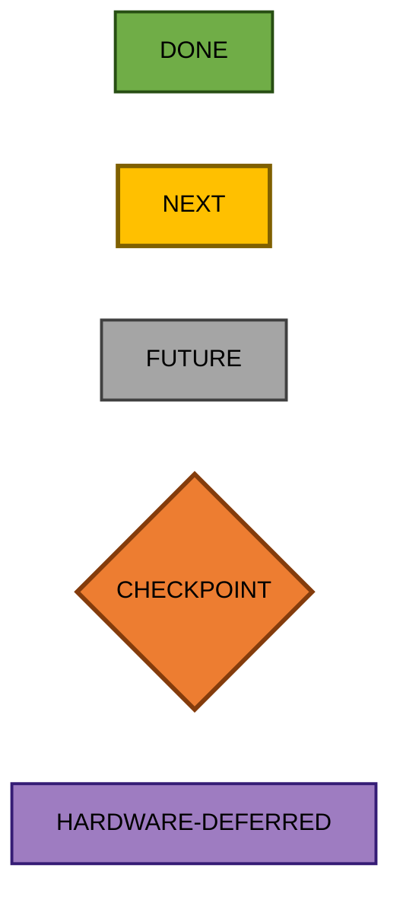
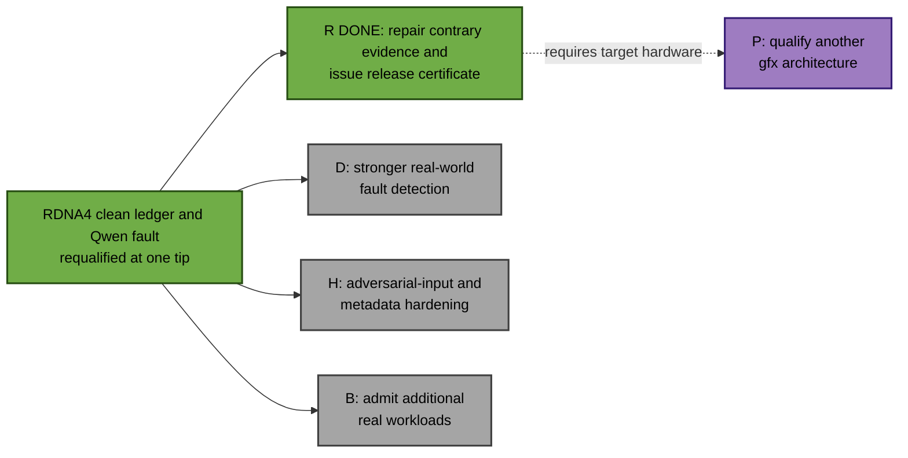
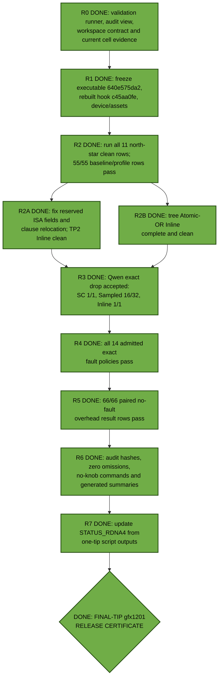
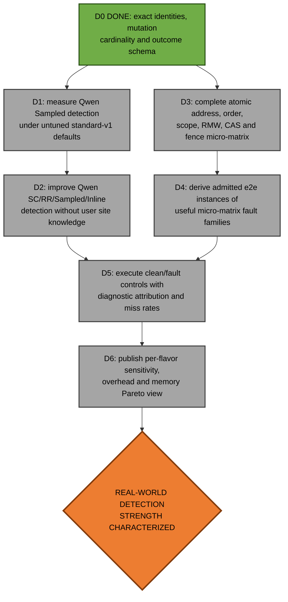
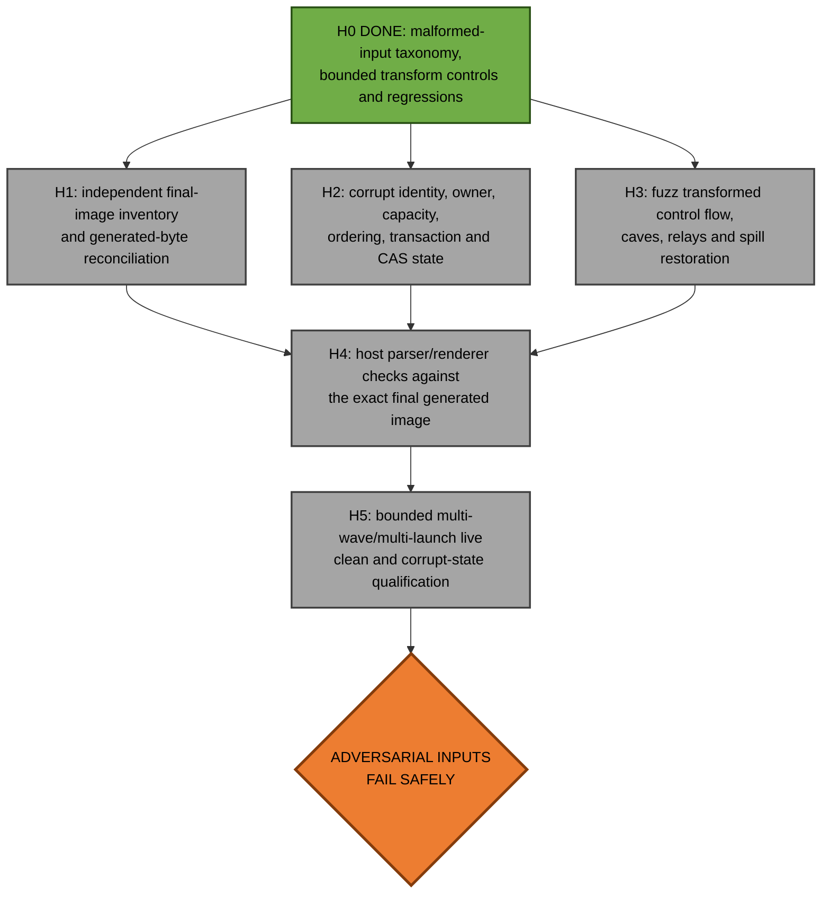
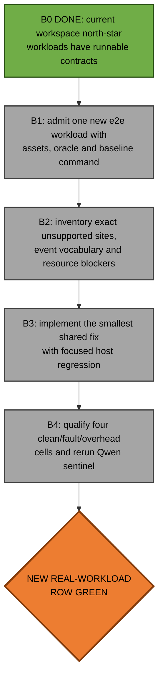
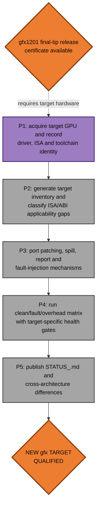

# ConSan future work

[STATUS_RDNA4.md](STATUS_RDNA4.md) records the gfx1201 north-star matrix. The
2026-07-16 final-tip pass found contrary evidence in five cells; focused
repairs and one-tip clean, fault, and overhead campaigns resolved them. The
gfx1201 release certificate is complete. The remaining tracks separately
improve actual fault-detection strength, adversarial robustness, workload
breadth, or hardware portability.

Prioritize demonstrable end-to-end LLM value over isolated-kernel breadth. Do
not reopen a completed cell merely to accumulate more worklog. If new evidence
finds a regression, update `STATUS_RDNA4.md` immediately and make that repair
the highest-priority runnable node.

Every solid edge means a real prerequisite: `A --> B` means finish `A` before
attempting `B`. Dashed edges denote unavailable-hardware dependencies.

## Status legend

## Program overview

The four RDNA4 tracks are technically independent. `R` converted heterogeneous
retained cell evidence into a single third-party-reproducible release
certificate. Work on `D`, `H`, or `B` should rerun the highest-value affected
e2e sentinel immediately.

## R: final-tip release certificate

This completed track compresses the former broad acceptance DAG into evidence
that can be reproduced by another developer.

Acceptance requires a clean committed tree and a hook rebuilt from exactly that
tree. Run no more than four GPU jobs in parallel; serialize fault rows capable
of destabilizing the device. Do not use the repository-wide CTest inventory as
a concurrent GPU certificate: it mixes unrelated fixtures that are not
mutually isolated. Run the 2,069-test host binary directly, and use this
validation runner for live workload rows. Every result retains pre/post GPU
health. Ordinary profiles must have no workload-specific coverage or sampling
settings.

## D: stronger fault detection

The green table permits honest qualified misses. This track asks the harder
question: how many real concurrency faults can each flavor actually diagnose,
especially on the end-to-end model rather than only on a micro-test?

`D1` is important because the retained Qwen Sampled detection rate belongs to
the explicit stride-256 fault experiment, while ordinary clean use now selects
`standard-v1` stride 16,384 automatically. Characterize the default before
deciding whether a different automatic policy is warranted. An experimental
multi-trial sweep may expose controls internally; the ordinary user contract
must not require tuning them.

Flavor contracts remain distinct: SuperCollider is a redundant-access
perturbation/check engine; Record/Replay observes its named bounded snapshot;
Sampled makes a statistical claim; Inline should attribute deterministic
causal or shadow-state diagnostics. Do not make a weak flavor look strong by
silently changing its memory or trial budget.

## H: adversarial-input hardening

ConSan is used on programs already suspected of synchronization mistakes.
Ill-formed final images, inconsistent metadata, failed publication, or a bad
injected mutation must fail with a bounded, typed outcome rather than hang,
crash, corrupt output silently, or reset the GPU.

This preserves the useful intent of the former Inline final-image DAG without
making it a retroactive prerequisite of the already-qualified workload cells.
See [MALFORMED_INPUT.md](MALFORMED_INPUT.md) for the normative taxonomy.

## B: additional real workloads and vocabulary

Do not resume the historical reject list or the abandoned 410-site
SuperCollider relay objective in the abstract. Broaden coverage only when a
concrete admitted real workload demonstrates the need.

An isolated kernel may be the shortest reproducer for `B3`, but it does not
become a status-table row unless it is independently valuable. New vocabulary
must retain typed exclusions for unsupported forms rather than weakening the
denominator or passing through silently.

## P: another gfx architecture

Do not infer architectural portability from gfx1201 host tests. Reuse the
validation scripts and experiment schema, but re-establish applicability,
final-byte mutation identities, clean correctness, diagnostics, performance,
memory, and device health on the target hardware.

## Maintenance rules

- Keep `STATUS_RDNA4.md` concise and evidence-backed; it is a result ledger,
  not a worklog.
- Update affected Mermaid node colors in the same commit as implementation or
  evidence changes.
- Use a new empty artifact directory after source, hook, manifest, or failed
  preparation changes; never mix provenance.
- Do not use coverage-limiting or workload-specific tuning for ordinary
  acceptance. Expert fault-campaign controls must be disclosed separately.
- Commit after each bounded node or coherent sibling group.
- Do not run more than four GPU jobs in parallel.
- Do not work on another architecture without suitable hardware.
