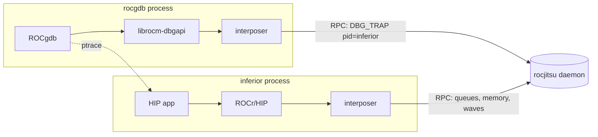

# Debugging emulated GPU kernels with ROCgdb

rocjitsu emulates the AMD KFD closely enough that **real ROCgdb / rocm-dbgapi**
can attach to a workload running on the emulated GPU and enumerate its agent —
no physical AMD GPU required. This document explains how the pieces fit
together, how to launch a workload under ROCgdb, and tracks what is implemented.

All KFD debug behaviour is mirrored from the real driver source
(`amd/amdkfd/{kfd_chardev.c,kfd_debug.c,kfd_topology.c}`, amdgpu-6.16.13),
cross-checked against a physical MI300X and the in-tree `projects/rocdbgapi`.

## 1. How the pieces fit together

ROCgdb does not talk to the GPU directly. It loads `librocm-dbgapi`, which opens
`/dev/kfd` and issues `AMDKFD_IOC_DBG_TRAP` sub-operations against the **pid of
the inferior**; the kernel correlates debugger and inferior by the ptrace
relationship. The emulator has no real `/dev/kfd`, so both processes run under
the rocjitsu LD_PRELOAD interposer and share one rocjitsu **daemon** that hosts
the GPU/wave state.



Local (in-process) mode cannot host ROCgdb: the debugger and inferior would each
get a private `SimulatedKfd`, so the debugger's dbgapi would never see the
inferior's process table. **Daemon mode is mandatory**, and `mirage run` drives
it in one command — it starts the session daemon, runs ROCgdb under the
interposer connected to that session, and ROCgdb launches the inferior into the
same session:

```bash
mirage run --profile mi350x -- rocgdb --args ./my_hip_app
```

## 2. Launching your workload under ROCgdb

1. Compile with device debug info, matching the mirage profile's arch
   (`mi350x` = `gfx950`):
   ```bash
   hipcc --offload-arch=gfx950 -g -O0 -o app app.hip
   ```
2. Run under `mirage run`:
   ```bash
   mirage run --profile mi350x -- rocgdb --args ./app
   ```
3. Host debugging and `info agents` work in this stack. GPU kernel breakpoints,
   wave state, and stepping require the pending wave-level support listed below.

## 3. Status

Attach and detach through `mirage run` work end to end: rocm-dbgapi attaches to
the process, enumerates the emulated GPU agent, and ROCgdb stops at host
breakpoints — `info agents` lists the synthetic `gfx950 / MI350X` agent. The
wave-level stack (stop at a kernel breakpoint, read/step wave state, watchpoints,
faults, private memory, multi-wave) is built on top of this in subsequent
changes and tracked below.

| Area | Status |
|---|---|
| Topology debug capabilities (`capability`/`debug_prop`) | done |
| `AMDKFD_IOC_DBG_TRAP` dispatcher + validation ladder | done |
| ENABLE / DISABLE + `kfd_runtime_info` | done |
| GET_DEVICE_SNAPSHOT agent enumeration | done |
| Real ptrace authorization + daemon transport | done |
| Debug sessions keyed by inferior pid (attach before connect) | done |
| SET_EXCEPTIONS_ENABLED / SET_FLAGS / launch-mode/override (accept) | done |
| Attach/detach lifecycle (including exited-inferior cleanup) | done |
| GET_QUEUE_SNAPSHOT (real queues) | done |
| Wave stop on `s_trap` + CWSR serialization | pending |
| Debug events + register write-back + single-step | pending |
| Watchpoints / illegal-instruction / memory-violation | pending |
| Private/scratch reads / multi-wave | pending |

## 4. Sources

- KFD UAPI: `linux/uapi/kfd_ioctl.h`, `linux/uapi/kfd_sysfs.h` (vendored).
- KFD driver: `amd/amdkfd/{kfd_chardev.c,kfd_debug.c,kfd_topology.c}`
  (amdgpu-6.16.13).
- Client: `projects/rocdbgapi/src/os_driver_kfd.cpp`.
- Hardware cross-check: MI300X sysfs `capability` / `debug_prop`.
